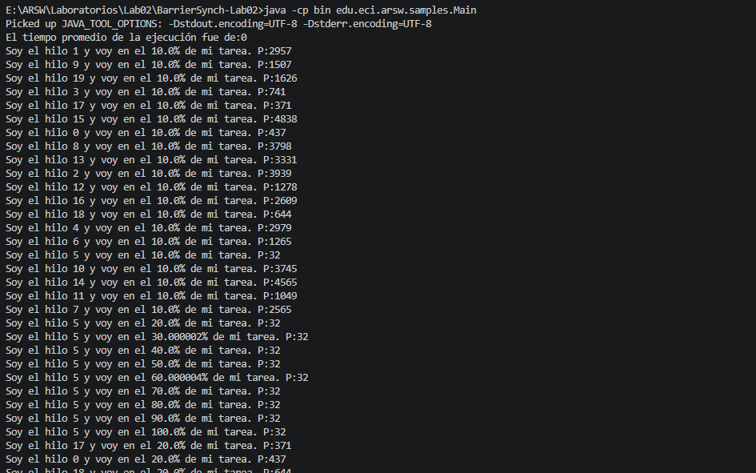
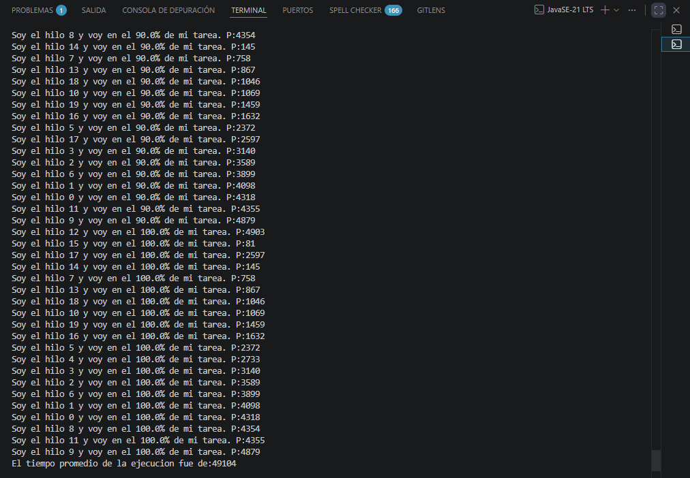

# BarrierSynch-Lab02

**Author:** Juan Carlos Bohorquez Monroy

Barrier synchronization laboratory in Java. Coordination of threads to work in phases and calculate the average execution time.

---

## Table of Contents

- [1. What does this program do?](#1-what-does-this-program-do)
- [2. What problems did it have?](#2-what-problems-did-it-have)
- [3. How were they fixed?](#3-how-were-they-fixed)
  - [3.1 Main now waits for threads](#31-main-now-waits-for-threads)
  - [3.2 Results are visible between threads](#32-results-are-visible-between-threads)
  - [3.3 Phase synchronization (Barrier)](#33-phase-synchronization-barrier)
- [4. Program output](#4-program-output)
  - [4.1 Before fixes (average = 0)](#41-before-fixes-average--0)
  - [4.2 After fixes (real average)](#42-after-fixes-real-average)
- [5. Understanding the average](#5-understanding-the-average)
  - [5.1 Without the barrier](#51-without-the-barrier)
  - [5.2 With the barrier](#52-with-the-barrier)
- [6. How to compile and run](#6-how-to-compile-and-run)
- [7. Requirements](#7-requirements)
- [8. Conclusions](#8-conclusions)
- [9. Project structure](#9-project-structure)

---

## 1. What does this program do?

The program creates **20 threads** that work in parallel. Each thread:

1. Has a random wait time `P` (between 0 and 4999 ms).
2. Executes **10 iterations** of simulated work.
3. In each iteration, it prints its progress and waits `P` milliseconds.
4. At the end, the program calculates the **average execution time** of all threads.

---

## 2. What problems did it have?

| # | Problem | What happened? |
|---|---------|----------------|
| 1 | `main` did not wait for threads | Average was **always 0** because it read results before threads finished |
| 2 | Poor data visibility | `main` could read outdated values from threads |
| 3 | No coordination between threads | Each thread ran independently, not waiting for others |

---

## 3. How were they fixed?

### 3.1 Main now waits for threads

`join()` was added: `main` "sleeps" until each thread finishes its work. Only when all have finished is the average calculated.

```
Before: main read result -> thread still working -> average = 0 [WRONG]
After:  main waits (join) -> thread finishes -> main reads result -> correct average [OK]
```

### 3.2 Results are visible between threads

`resultado` was declared as `volatile`. This guarantees that when a thread writes its result, `main` sees it immediately.

### 3.3 Phase synchronization (Barrier)

**`CyclicBarrier`** was used, a Java mechanism that forces threads to wait for each other.

```
Iteration 1:         Iteration 2:
Thread A --work--> [BARRIER] --work--> [BARRIER] ...
Thread B --work--> [BARRIER] --work--> [BARRIER] ...
Thread C --work--> [BARRIER] --work--> [BARRIER] ...
                   ^                          ^
                   Everyone waits             Everyone waits
                   for the slowest            for the slowest
```

**How it works:** At the end of each iteration, every thread calls `barrier.await()`. The barrier blocks each thread until all **20 threads** have arrived. When the last one arrives, everyone continues together to the next iteration.

---

## 4. Program output

### 4.1 Before fixes (average = 0)



The average printed **immediately** (without waiting for threads):

```
El tiempo promedio de la ejecucion fue de:0   [ERROR: prints first, value = 0]
Soy el hilo 0 y voy en el 10.0% de mi tarea. P:184
Soy el hilo 10 y voy en el 10.0% de mi tarea. P:316
...
```

### 4.2 After fixes (real average)



The average prints **at the end**, when all threads have finished:

```
Soy el hilo 15 y voy en el 10.0% de mi tarea. P:81
Soy el hilo 12 y voy en el 10.0% de mi tarea. P:4903
...
Soy el hilo 12 y voy en el 100.0% de mi tarea. P:4903
El tiempo promedio de la ejecucion fue de:49104  [CORRECT: prints last, real value]
```

---

## 5. Understanding the average

### 5.1 Without the barrier

Each thread runs at its own pace:

| Thread | P (wait) | Total time |
|--------|----------|------------|
| Fast (P=81) | 81 ms | 10 x 81 = **810 ms** (finishes in seconds) |
| Slow (P=4903) | 4903 ms | 10 x 4903 = **49030 ms** (finishes in ~49 sec) |

- **Ideal average:** ~26147 ms
- **Real average (due to bug):** 0 (never waited for threads)

### 5.2 With the barrier

All threads wait for the slowest one in each phase:

```
Phase 1: Fast thread (P=81) -> works 81ms -> waits at barrier
         Slow thread (P=4903) -> works 4903ms -> arrives at barrier -> everyone continues
         Phase duration = 4903ms (the slowest sets the pace)

Phase 2: Same -> 4903ms
...
Phase 10: Same -> 4903ms
```

**Each thread finishes in:** 10 x 4903 = **49030 ms** + small overhead (~74 ms from printing)

| Metric | Without Barrier | With Barrier |
|--------|----------------|--------------|
| Fastest thread | 810 ms | 49030 ms (waits at barrier) |
| Slowest thread | 49030 ms | 49030 ms |
| Average | 0 (bug) | **49104 ms** [OK] |

> **Why does the average increase with the barrier?** Because fast threads intentionally wait for slow ones at each phase. That is exactly what a synchronization barrier does.

---

## 6. How to compile and run

From a terminal in the project root:

```powershell
# 1. Compile
javac -d bin -encoding ISO-8859-1 src\edu\eci\arsw\samples\Main.java src\edu\eci\arsw\samples\HiloProc.java

# 2. Run
java -cp bin edu.eci.arsw.samples.Main
```

> You can also press **F5** in VS Code (if you have the Java extension installed).

---

## 7. Requirements

- **Java:** JDK 8 or higher.
- **OS:** Windows / Linux / macOS.
- **Dependencies:** None.

---

## 8. Conclusions

This lab allowed applying fundamental concurrency concepts in Java:

- **`join()`** is essential to synchronize the main thread with worker threads. Without it, the program reads incomplete data and produces incorrect results.
- **`volatile`** guarantees data visibility between threads, avoiding stale reads.
- **`CyclicBarrier`** allows coordinating threads by phases, ensuring everyone advances together. This is useful in parallel computing where each phase must be fully completed before starting the next one.
- The synchronization **overhead** is minimal (~74 ms vs ~49 s of execution), demonstrating that the barrier is efficient.
- The average with barrier reflects the slowest thread's time (`10 x max(P)`), which is the expected behavior of strict phase synchronization.

This project shows how small concurrency errors can completely invalidate results, and how `java.util.concurrent` tools solve them elegantly and efficiently.

---

## 9. Project structure

```
BarrierSynch-Lab02/
|-- README.md                   <- This file
|-- PLAN.md                     <- Technical documentation for developers
|-- contexto.md
|-- Images/
|   |-- Ejecucion_sin_correccion.png
|   |-- Ejecucion_con_correcciones.png
|-- src/                        <- Source code
|   |-- edu/eci/arsw/samples/
|       |-- Main.java
|       |-- HiloProc.java
|-- bin/                        <- Compiled files
|-- .vscode/                    <- VS Code configuration
```
